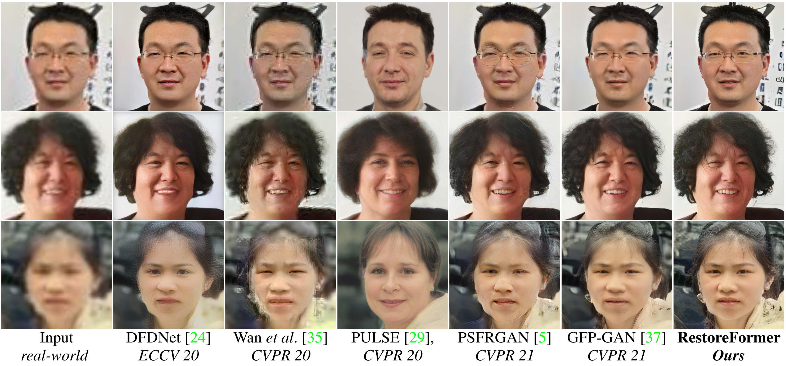
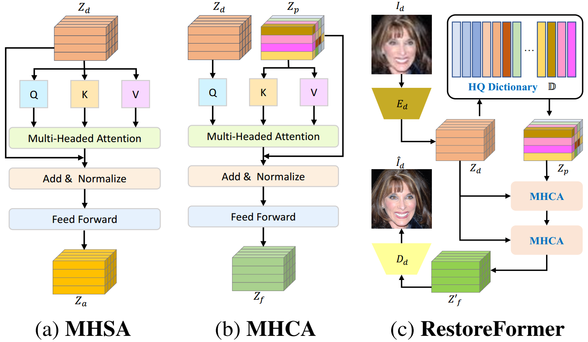

# RestoreFormer

This repo includes the source code of the paper: "[RestoreFormer: High-Quality Blind Face Restoration from Undegraded Key-Value Pairs](https://arxiv.org/pdf/2201.06374.pdf)" (CVPR 2022) by Zhouxia Wang, Jiawei Zhang, Runjian Chen, Wenping Wang, and Ping Luo.

**RestoreFormer** tends to explore fully-spatial attentions to model contextual information and surpasses existing works that use local operators. It has several benefits compared to prior arts. First, it incorporates a multi-head coross-attention layer to learn fully-spatial interations between corrupted queries and high-quality key-value pairs. Second, the key-value pairs in RestoreFormer are sampled from a reconstruction-oriented high-quality dictionary, whose elements are rich in high-quality facial features specifically aimed for face reconstruction.

<!-- -->

## Environment

- python>=3.7
- pytorch>=1.7.1
- pytorch-lightning==1.0.8
- omegaconf==2.0.0
- basicsr==1.3.3.4

**Warning** Different versions of pytorch-lightning and omegaconf may lead to errors or different results.

## Preparations of dataset and models

**Dataset**: Both **HQ Dictionary** and **RestoreFormer** in our work are trained with **FFHQ** which attained from [FFHQ repository](https://github.com/NVlabs/ffhq-dataset). The original size of the images in FFHQ are 1024x1024. We resize them to 512x512 with bilinear interpolation in our work. Link this dataset to ./data/FFHQ/image512x512.

**Model**: Both pretrained models used for training and the trained model of our RestoreFormer can be attained from [Google Driver](https://drive.google.com/file/d/13ir-VvdDNOA3LeoNbx4Y530rvIheyhRM/view?usp=sharing) or [BaiduYun (code x6nn)](https://pan.baidu.com/s/1EO7_1dYyCuORpPNosQgogg?pwd=x6nn). Link these models to ./experiments.

## Test
    sh scripts/test.sh

## Training
    sh scripts/run.sh

**Note**. 
- The first stage is to attain **HQ Dictionary** by setting `conf_name` in scripts/run.sh to 'HQ\_Dictionary'. 
- The second stage is blind face restoration. You need to add your trained HQ\_Dictionary model to `ckpt_path` in config/RestoreFormer.yaml and set `conf_name` in scripts/run.sh to 'RestoreFormer'.
- Our model is trained with 4 V100 GPUs.

## Citation
    @article{wang2022restoreformer,
      title={RestoreFormer: High-Quality Blind Face Restoration from Undegraded Key-Value Pairs},
      author={Wang, Zhouxia and Zhang, Jiawei and Chen, Runjian and Wang, Wenping and Luo, Ping},
      booktitle={The IEEE Conference on Computer Vision and Pattern Recognition (CVPR)},
      year={2022}
    }

## Acknowledgement
We thank everyone who makes their code and models available, especially [Taming Transformer](https://github.com/CompVis/taming-transformers), [basicsr](https://github.com/XPixelGroup/BasicSR), and [GFPGAN](https://github.com/TencentARC/GFPGAN).

## Contact
For any question, feel free to email `wzhoux@connect.hku.hk` or `zhouzi1212@gmail.com`.
